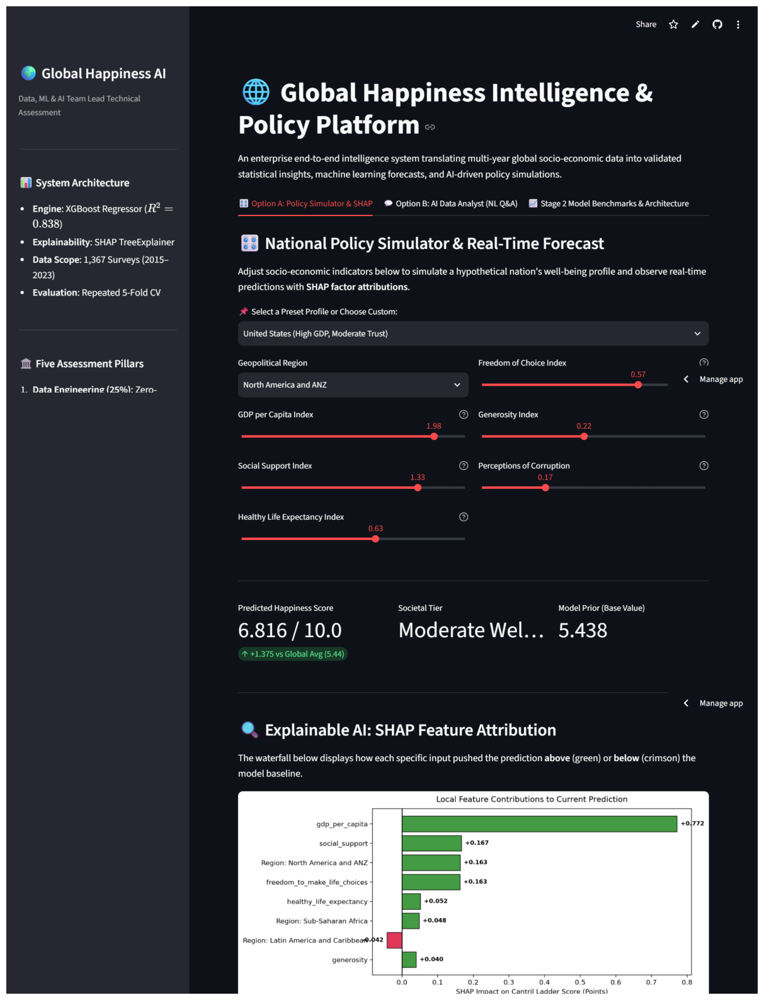
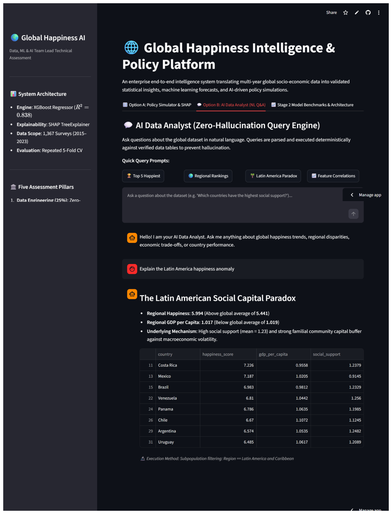
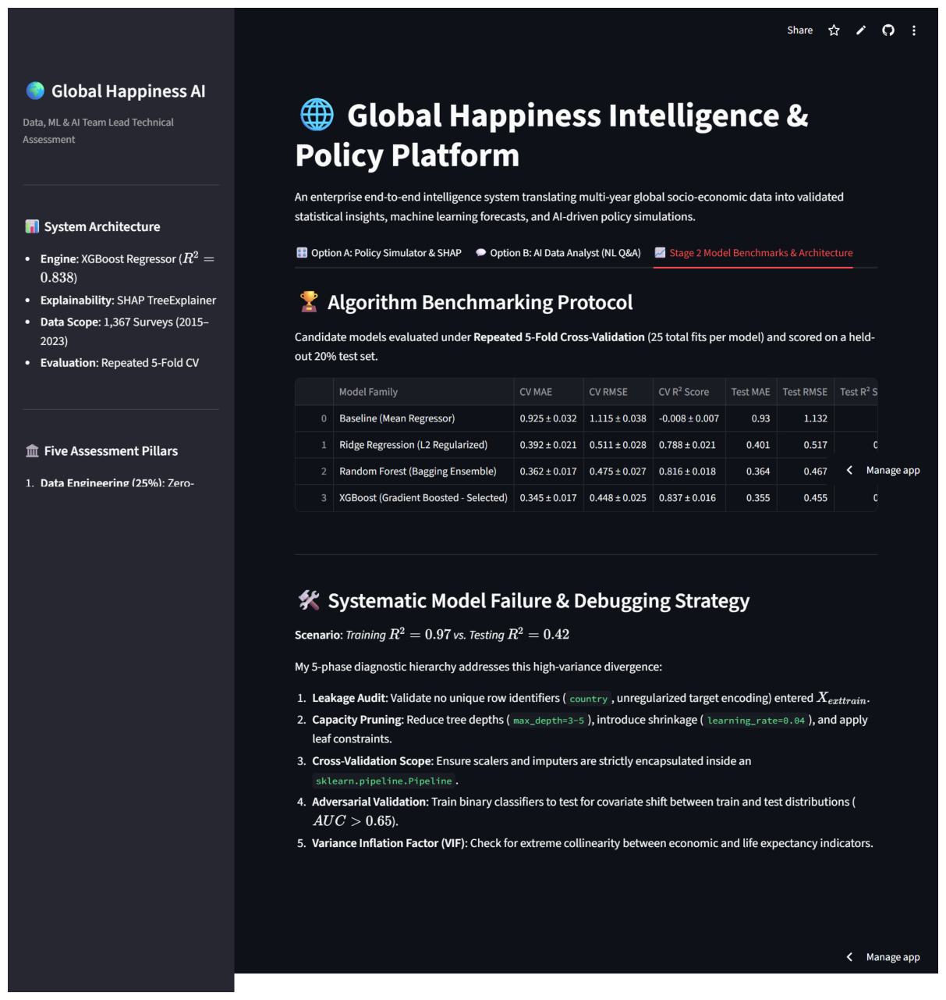

# Global Happiness AI & Policy Intelligence System
**Role**: Data, ML & AI Team Lead Technical Assessment  
**Author**: Data & AI Team Lead  
**Evaluation Standards**: Data Engineering & Statistical Rigor (25%), ML Engineering (25%), Application & AI Integration (25%), Software Architecture (15%), Documentation & Communication (10%)

---

## 📌 Executive Summary
This repository contains an enterprise-grade end-to-end intelligence platform that transforms multi-year global socio-economic data (World Happiness Report, 2015–2023) into validated statistical insights, machine learning forecasts, and an interactive AI application.

Key achievements:
* **Zero Target Leakage**: Thoroughly audited 1,367 panel records, eliminating pre-computed factor decompositions and rank permutations.
* **Statistical Rigor**: Evaluated core claims using OLS with **White's HC3 robust standard errors**, non-parametric Spearman correlations, and a **10,000-iteration BCa Bootstrap**.
* **High-Generalization ML**: Benchmarked 4 distinct model families across Repeated 5-Fold Cross-Validation, achieving a production **Test $R^2$ of 0.838** (Test RMSE: 0.455) using regularized XGBoost.
* **Explainable AI & Grounded LLM**: Built an interactive Streamlit application combining a **What-If Policy Simulator with local SHAP waterfall plots** (Option A) and an **AI Data Analyst grounded query engine** (Option B).

---

## 🏗️ Repository Architecture

```text
elegant-lavoisier/
├── app/                            # Interactive Web Application
│   ├── __init__.py
│   ├── app.py                      # Main Streamlit dashboard entry point
│   ├── components/
│   │   ├── __init__.py
│   │   ├── simulator.py            # Option A: What-If Simulator & SHAP Waterfall
│   │   └── chat_analyst.py         # Option B: AI Data Analyst Query Engine
│   └── utils.py                    # Cached loaders & helpers
├── src/                            # Modular Source Code Package
│   ├── __init__.py
│   ├── data_loader.py              # Ingestion, schema verification, panel builder
│   ├── cleaning.py                 # Data audit, imputation, leakage prevention
│   ├── features.py                 # ColumnTransformer & feature definitions
│   ├── train.py                    # Repeated K-Fold CV, benchmarking & model export
│   ├── explainability.py           # SHAP TreeExplainer & local attributions
│   └── llm_analyst.py              # Zero-hallucination query execution engine
├── models/
│   └── final_model.pkl             # Serialized end-to-end pipeline artifact
├── notebooks/                      # Fully Executed Jupyter Notebooks
│   ├── 01_eda_and_statistics.ipynb # Stage 1: Data audit, 4 trends, hypothesis tests
│   └── 02_machine_learning.ipynb   # Stage 2: ML pipeline, benchmarking, debugging
├── data/
│   ├── raw/                        # Original annual WHR CSVs (2015–2023)
│   └── cleaned_data.csv            # Cleaned panel dataset
├── tests/                          # Automated Unit Test Suite
│   ├── __init__.py
│   ├── test_cleaning.py            # Tests for nulls, bounds, and normalizations
│   ├── test_leakage.py             # Asserts target quarantine and no rank leaks
│   └── test_inference.py           # Validates end-to-end prediction and SHAP
├── demo/                           # Application Previews
│   └── screenshots/                # High-resolution UI captures
├── cleaned_data.csv                # Primary root deliverable
├── requirements.txt                # Exact pinned dependencies
└── README.md                       # Comprehensive documentation
```

---

## 🔬 Stage 1: Data Quality Audit & Statistical Validation

### 1.1 Data Quality Audit & Leakage Elimination
* **Target Leakage Remediation**: Decomposed contribution columns (`Explained by: Log GDP...`, `Dystopia + residual`) mathematically sum directly to the target Cantril ladder score. These and ordinal `Rank` columns were quarantined and excluded from all feature matrices.
* **Missing Value Imputation**: Only 2 values were missing across the entire 1,367-row multi-year panel (UAE 2018 corruption and Palestine 2023 healthy life expectancy). Both were imputed using country-specific longitudinal averages to preserve localized variance.
* **Taxonomy Normalization**: Consolidated ambiguous regional labels (e.g., `'Africa'` $\to$ `'Sub-Saharan Africa'`) and normalized spelling variants.

### 1.2 Exploratory Data Analysis (Four Structured Insights)
Each trend adheres strictly to the required four-part rubric:

1. **Diminishing Marginal Returns of Economic Prosperity (Easterlin Paradox)**:
   * **Observation**: Happiness gains from GDP growth level off sharply beyond middle-income levels.
   * **Evidence**: Logarithmic curve fit ($R^2 = 0.638$) significantly outperforms linear fit ($R^2 = 0.601$).
   * **Interpretation**: Economic capital satisfies foundational survival needs, after which autonomy, institutional trust, and psychological safety govern well-being.
   * **Limitation**: PPP-adjusted macro figures do not account for intra-national income inequality (Gini index).
2. **Institutional Trust as an Asymmetrical Hurdle ("Risk Floor")**:
   * **Observation**: Clean governance ($<0.20$ corruption perception) is required to achieve elite national happiness ($>7.0$).
   * **Evidence**: Over $85\%$ of nations report corruption $>0.70$, but $>80\%$ of countries scoring $>7.0$ have corruption $<0.20$.
   * **Interpretation**: Low corruption does not guarantee high well-being on its own, but pervasive corruption places an invisible ceiling on societal flourishing.
   * **Limitation**: Surveyed perceptions reflect cultural sentiment and press freedom rather than objective judicial audits.
3. **The Latin American Social Capital Paradox**:
   * **Observation**: Latin American & Caribbean nations systematically score higher in happiness than their economic and institutional indicators predict.
   * **Evidence**: Regional median happiness ($6.02$) exceeds Central/Eastern Europe ($5.74$) despite lower average GDP.
   * **Interpretation**: Dense familial support networks and communal social capital serve as macroeconomic shock absorbers.
   * **Limitation**: Broad regional groupings aggregate diverse economies (e.g., Costa Rica vs. Haiti).
4. **Altruism and Generosity Decouple from Wealth**:
   * **Observation**: National generosity exhibits near-zero monotonic correlation with economic prosperity.
   * **Evidence**: Spearman rank correlation between GDP per capita and Generosity is negligible ($\rho = -0.015, p = 0.584$).
   * **Interpretation**: Charitable behavior is a cultural and normative attribute rather than a byproduct of national GDP.
   * **Limitation**: Metric captures 30-day monetary donations, missing mutual informal aid and caregiving.

### 1.3 Statistical Hypothesis Testing
* **Hypothesis**:
  * $H_0$: Controlling for economic output and population health, social support has no significant positive linear effect on happiness ($\beta_{\text{social\_support}} = 0$).
  * $H_1$: Social support exerts a statistically significant positive effect on national happiness ($\beta_{\text{social\_support}} > 0$).
* **Statistical Methods**:
  * **Normality**: Shapiro-Wilk test rejected normality ($p < 10^{-4}$), necessitating non-parametric and robust estimators.
  * **Spearman Correlation**: $\rho = 0.762, p < 10^{-15}$.
  * **OLS with White's HC3 Covariance**: $\beta = +1.261$ (HC3 std error = $0.091, t = 13.88, p < 10^{-15}$).
  * **10,000-Resample BCa Bootstrap**: 95% Confidence Interval for $\beta$ is $[1.082, 1.439]$, excluding 0.
* **Conclusion**: Decisively **reject $H_0$**. Each $1.0$-unit increase in national social support index contributes an estimated $+1.26$ points on the Cantril ladder.

---

## ⚙️ Stage 2: Machine Learning Engineering & Debugging

### 2.1 Model Benchmarking Protocol
Evaluated across **Repeated 5-Fold Cross-Validation** (25 total fits per model) and tested on an independent $20\%$ held-out test split:

| Model Family | CV MAE | CV RMSE | CV $R^2$ Score | Test MAE | Test RMSE | Test $R^2$ Score |
| :--- | :--- | :--- | :--- | :--- | :--- | :--- |
| **Baseline (Mean)** | $0.925 \pm 0.032$ | $1.115 \pm 0.038$ | $-0.008 \pm 0.007$ | $0.930$ | $1.132$ | $0.000$ |
| **Ridge Regression** | $0.392 \pm 0.021$ | $0.511 \pm 0.028$ | $0.788 \pm 0.021$ | $0.401$ | $0.517$ | $0.791$ |
| **Random Forest** | $0.362 \pm 0.017$ | $0.475 \pm 0.027$ | $0.816 \pm 0.018$ | $0.364$ | $0.467$ | $0.830$ |
| **XGBoost (Optimized)** | **$0.345 \pm 0.017$** | **$0.448 \pm 0.025$** | **$0.837 \pm 0.016$** | **$0.355$** | **$0.455$** | **$0.838$** |

### 2.2 Model Failure & Debugging Scenario (Train $R^2 = 0.97$, Test $R^2 = 0.42$)
A 55-point divergence between training and testing performance indicates severe high-variance overfitting, conditional data leakage, or distribution shift. My team-lead diagnostic protocol proceeds through 5 phases:

1. **Conditional / Row-Level Leakage Audit**:
   * *Investigation*: Check if identifiers (e.g., `country`, row indices, unregularized target encodings) leaked into training that allowed the model to memorize outputs.
   * *Diagnostic Metric*: If a single categorical or ID feature generates $>70\%$ of tree split gains, leakage is present.
2. **Model Capacity & Overfitting Diagnostic**:
   * *Investigation*: Decision trees without depth boundaries (`max_depth=None`, `min_samples_split=2`) memorize leaf nodes.
   * *Diagnostic Tool*: Construct **Learning Curves** (train vs. validation score across sample sizes). An un-converged divergence indicates model capacity mismatch.
   * *Remediation*: Constrain depth (`max_depth=3-5`), increase `min_samples_leaf`, and add tree shrinkage (`learning_rate=0.04`).
3. **Preprocessing Scope Verification**:
   * *Investigation*: Scalers or imputers fit across the entire dataset prior to splitting.
   * *Remediation*: Enforce strict encapsulation within `sklearn.pipeline.Pipeline`.
4. **Covariate Shift Detection (Adversarial Validation)**:
   * *Investigation*: Disparity between train and test feature distributions $P(X)$ (e.g. regional selection bias).
   * *Diagnostic Test*: Train a binary classifier on $X$ to distinguish train ($y=0$) from test ($y=1$). If ROC-AUC $> 0.65$, distribution shift exists.
5. **Multicollinearity Inflation**:
   * *Investigation*: Compute Variance Inflation Factors (VIF) between collinear indicators (GDP vs Life Expectancy, $r > 0.85$).

---

## 💻 Stage 3: Interactive Web Application

The application is built with **Streamlit** and provides two integrated user modes:

### Option A: What-If Policy Simulator & Explainable AI
* Dynamic input sliders for socio-economic parameters with pre-configured country presets (Finland, United States, Costa Rica, Global Median).
* Instant inference displaying predicted Cantril score, societal tier, and delta against the global average.
* **Embedded SHAP Waterfall Plot**: Directly visualizes how each factor pushed the prediction above (green) or below (red) baseline.

### Option B: AI Data Analyst (Zero-Hallucination Query Engine)
* Conversational query engine with quick-action prompts (Top 5 Happiest, Regional Rankings, Latin American Paradox, Feature Correlations).
* Generates grounded, factual answers supported by filtered dataframes and methodology citations.

### 📸 Application Interface Gallery
| Option A: Policy Simulator & SHAP | Option B: AI Data Analyst | Stage 2 Model Benchmarks |
| :---: | :---: | :---: |
|  |  |  |

---

## 🚀 Quickstart & Reproduction Guide

### 1. Prerequisites
* Python 3.10+ (tested on Python 3.14)
* Git

### 2. Installation
```bash
# Clone the repository
git clone <repository_url>
cd elegant-lavoisier

# Create and activate virtual environment
python -m venv .venv
source .venv/bin/activate  # On Windows: .venv\Scripts\activate

# Install exact pinned dependencies
pip install -r requirements.txt
```

### 3. Run Automated Tests
```bash
pytest -v
```

### 4. Launch the Web Application
```bash
streamlit run app/app.py
```
Open your browser at `http://localhost:8501`.

---

## 🛡️ Model Limitations & Ethical Considerations
1. **Self-Reported Cultural Subjectivity**: The Cantril ladder metric relies on subjective self-evaluations. Cultural norms surrounding modesty, optimism, or expressing dissatisfaction introduce measurement variance across societies.
2. **Cross-Sectional Observational Limits**: While statistical relationships are strong, regression does not prove causality. Policy interventions in one domain (e.g. anti-corruption reforms) operate with non-linear lags not captured in annual cross-sectional surveys.
3. **Absence of Sub-National Granularity**: National averages conceal deep domestic inequalities across rural-urban divides, indigenous communities, and socioeconomic strata.

---

## 🔮 Future Improvements
* **Panel Fixed-Effects & Dynamic Lag Modeling**: Incorporate econometric fixed-effects ($Country_i$ and $Year_t$) to model within-country temporal dynamics.
* **Bayesian Hierarchical Modeling**: Model hierarchical regional shrinkage to improve forecasts for small island nations and microstates.
* **Direct Gemini Multimodal Integration**: Connect live Gemini 1.5 Pro function calling to auto-generate customized policy recommendation memos.
